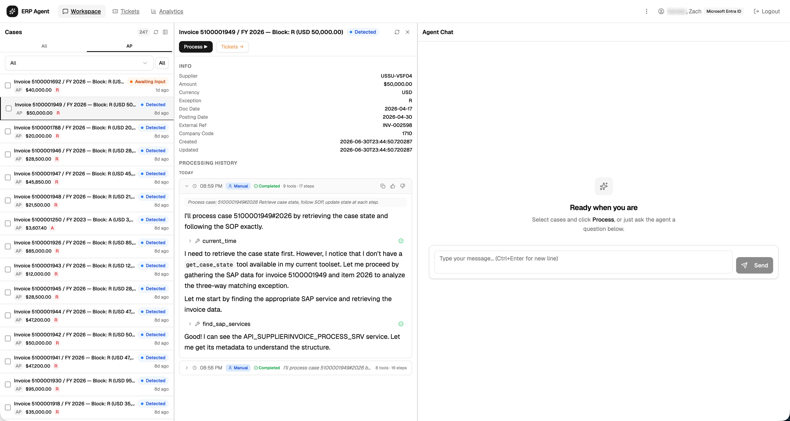
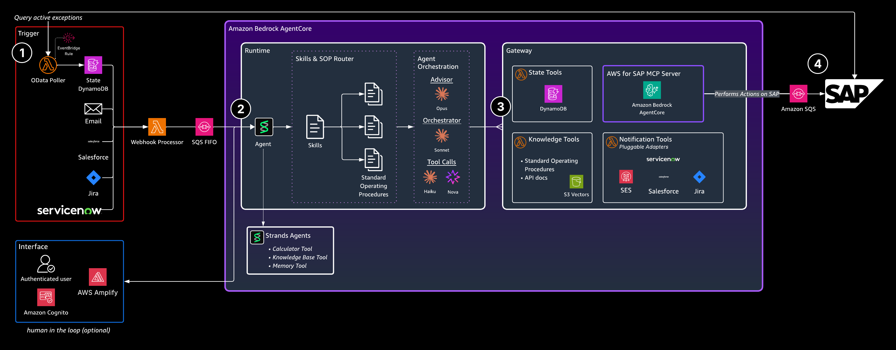

<!--
Copyright Amazon.com, Inc. or its affiliates. All Rights Reserved.
SPDX-License-Identifier: Apache-2.0
-->

# Agentic ERP Automation Quickstart

   


> [!WARNING]
> This is a reference implementation intended for demonstration purposes. Review and adapt it — especially auth, autonomy controls, and SAP write paths — before deploying to a production environment. See [NOTICE](NOTICE) for details.
>
> This is sample code, for non-production usage. You should work with your security and legal teams to meet your organizational security, regulatory and compliance requirements before deployment.



**Jump to:** [Quick Start](#quick-start) · [Architecture](#architecture) · [Key Features](#key-features) · [Extending](#extending) · [Docs](#documentation)

## Included Use Case: SAP Finance Exception Processing

A multi-skill autonomous agent that processes SAP finance exceptions across domains:

- **PO Accruals** — Detects month-end accrual exceptions, validates delivery dates, calculates time-proportional accruals, updates SAP schedule lines, creates parked journal entries
- **AP Invoice Matching** — Processes invoice exceptions, validates PO/GR matching, routes for approval

The agent is driven by Standard Operating Procedures (SOPs) stored in S3 and dynamically loaded at runtime based on the exception type. New domains are added by dropping in a skill config + SOP — no agent code changes (see [Adding Use Cases](docs/extending/ADDING_USE_CASES.md)).

## Architecture



## Quick Start

Deploys all AWS infrastructure, a Cognito login, and a working agent you can chat with. SAP is optional — the agent deploys and runs without it.

Plan for ~20–30 minutes end-to-end (CDK deploy alone is 10–20 min), plus any wait for Bedrock model access approval. Running cost: ~$0.26/case processed ([benchmark](docs/evaluations/COST_BENCHMARK.md)); idle infrastructure cost is low (serverless, pay-per-use).

### Prerequisites

- Node.js 20+, npm
- Python 3.12+
- AWS CLI (configured with appropriate permissions)
- AWS CDK (`npm install -g aws-cdk`)
- **Bedrock model access enabled** for Claude in your target region — [request access](https://docs.aws.amazon.com/bedrock/latest/userguide/model-access.html) before you start.

> [!IMPORTANT]
> Missing Bedrock model access is the most common first-deploy failure. Request it before running `make setup` — approval can take a few minutes to a few hours.

### First-Time Setup

The guided setup walks you through everything — config, deploy, SAP credentials, and knowledge base sync:

```bash
make setup
```

That's the whole happy path. Only two config values are required to start: `stack_name_base` and `admin_user_email`. Everything else has safe defaults.

Prefer to run each step yourself:

```bash
cp cdk/config.yaml.example cdk/config.yaml   # edit: stack_name_base, admin_user_email
python scripts/setup.py                       # prereqs → config → cdk deploy → frontend
./scripts/sync-sap-secret.sh                  # (optional) sync SAP service-account creds
./scripts/sync-knowledge-base.sh              # sync SOPs + API docs to S3
```

Full walkthrough, including auth-profile options and troubleshooting: [Deployment Guide](docs/getting-started/DEPLOYMENT.md).

### Redeploy After Code Changes

```bash
make deploy-all
```

This runs CDK deploy, refreshes all Lambdas (so they pick up new SSM values), and redeploys the frontend.

### Available Make Targets

Run `make` to see all available targets grouped by category (Getting Started, Operations, Development, Code Quality).

See [Deployment Guide](docs/getting-started/DEPLOYMENT.md) for full instructions, [scripts/README.md](scripts/README.md) for all available scripts.

## Key Features

- **Multi-Skill Agent** — Dynamically loads domain expertise based on exception type. Each skill has a `config.json`, `base_prompt.txt`, and SOPs injected at runtime. Auto-discovered, no code changes to add new domains.
- **Managed SAP OData via MCP** — the agent reaches SAP (reads, writes, discovery) through the external [AWS for SAP MCP Server](https://docs.aws.amazon.com/mcp-sap/latest/awsforsapmcp/introduction.html): service discovery, metadata inspection, and OData read/write/function-import tools. Our CDK is a thin adapter (Gateway target + OAuth2 provider) pointed at a customer-deployed SAP MCP stack; write enablement lives on that stack. See [ADR-012](docs/design-decisions/012-sap-mcp-server-integration.md).
- **Autonomy Controls** — Two SSM-backed toggles (`trigger-mode`, `action-mode`) flippable without redeployment. Action-mode enforced at the Lambda level.
- **Pluggable Notifications** — SES, Slack, Jira, or ServiceNow — one config value swap in `config.yaml`.
- **Ticket Management** — Built-in escalation and approval workflows correlated to ERP cases.
- **SAP Connectivity & Identity** — Reference-only networking (you manage VPC/peering/VPN). The agent reaches SAP through the external AWS for SAP MCP server (reads + writes + discovery); the autonomous poller uses a service-account. See [SAP docs](docs/sap/CONNECTIVITY_AND_AUTH.md).
- **Pluggable Enterprise Auth** — one config value (`auth_profile`) selects a full frontend/inbound/outbound identity path: Cognito + service-account for POC, or Entra/Okta-backed per-user identity (M2M, user federation, or seamless OBO token exchange) for production SAP access. See [Auth Profile Selection](docs/sap/AUTH_PROFILE_SELECTION.md).
- **Cedar Policy Engine** — Gateway authorization via deterministic Cedar policies. See [ADR-004](docs/design-decisions/004-cedar-policy-engine.md).
- **OData Discovery via MCP** — the SAP MCP server's `find_sap_services` / `get_metadata` / `get_service_hints` tools handle service discovery and `$metadata` inspection at runtime; no homegrown spec cache.

## Extending

Add a new exception type: create `skills/<domain>/config.json` + `base_prompt.txt`, upload SOPs, `cdk deploy`. No agent code changes.

Add a new Gateway tool: create `gateway/tools/<name>/` with handler + `tool_spec.json`, `cdk deploy`. Auto-discovered by CDK.

See [Adding Use Cases](docs/extending/ADDING_USE_CASES.md) for the full end-to-end guide.

## Project Structure

See [Contributing Guide](docs/getting-started/CONTRIBUTING.md#project-layout) for the full directory tree. Key directories:

| Directory | What lives there |
|-----------|-----------------|
| `agentcore/` | Agent code (Strands SDK), Gateway tools, Cedar policies, evals |
| `lambdas/` | All Lambda functions: pollers, APIs, webhooks, custom resources |
| `skills/` | Domain skill configs + base prompts (auto-discovered) |
| `knowledge-base/` | SOPs + SAP API docs (synced to S3) |
| `cdk/` | CDK infrastructure (primary IaC path) |
| `frontend/` | React app (Amplify Hosting) |
| `docs/` | All documentation ([start here](docs/README.md)) |

## Built With

- [Amazon Bedrock AgentCore](https://aws.amazon.com/bedrock/agentcore/) — Runtime, Gateway, Memory, Identity
- [AWS for SAP MCP Server](https://docs.aws.amazon.com/mcp-sap/latest/awsforsapmcp/introduction.html) — Managed SAP OData MCP tools (optional)
- [Strands Agents SDK](https://github.com/awslabs/strands-agents) — Agent framework
- [FAST](https://github.com/awslabs/fullstack-solution-template-for-agentcore) — Fullstack template
- [AWS CDK](https://aws.amazon.com/cdk/) / [Terraform](https://www.terraform.io/) — Infrastructure as Code
- [Cedar](https://www.cedarpolicy.com/) — Policy-based authorization for Gateway tools

## Documentation

Full documentation index: [docs/README.md](docs/README.md)

| Category | Key Documents |
|----------|---------------|
| Getting Started | [Architecture](docs/getting-started/ARCHITECTURE.md) · [Deployment](docs/getting-started/DEPLOYMENT.md) · [Terraform](docs/getting-started/TERRAFORM_DEPLOYMENT.md) · [Local Dev](docs/getting-started/LOCAL_DEVELOPMENT.md) · [Contributing](docs/getting-started/CONTRIBUTING.md) |
| SAP Integration | [Overview](docs/sap/README.md) · [Auth Profile Selection](docs/sap/AUTH_PROFILE_SELECTION.md) · [Connectivity & Auth](docs/sap/CONNECTIVITY_AND_AUTH.md) · [SAP Setup](docs/sap/SAP_SETUP.md) · [SAP MCP Integration](docs/sap/SAP_MCP_INTEGRATION.md) |
| Agent Internals | [Configuration](docs/agent/AGENT_CONFIGURATION.md) · [Gateway](docs/agent/GATEWAY.md) · [Auth](docs/agent/RUNTIME_GATEWAY_AUTH.md) · [Memory](docs/agent/MEMORY_INTEGRATION.md) · [Streaming](docs/agent/STREAMING.md) |
| Extending | [Adding Use Cases](docs/extending/ADDING_USE_CASES.md) · [Adding Skills](docs/extending/ADDING_SKILLS.md) · [Adding Tools](docs/extending/ADDING_GATEWAY_TOOLS.md) |
| Evaluations | [Quick Start](docs/evaluations/EVALUATIONS_QUICKSTART.md) · [Cost Benchmark](docs/evaluations/COST_BENCHMARK.md) · [Full Guide](docs/evaluations/AGENTCORE_EVALUATIONS_GUIDE.md) |
| Security | [Input Sanitization](docs/security/INPUT_SANITIZATION.md) · [Autonomy Controls](docs/security/AUTONOMY_CONTROLS.md) · [Webhook Verification](docs/security/WEBHOOK_VERIFICATION.md) |
| Design Decisions | [ADR-001](docs/design-decisions/001-gateway-over-self-hosted-mcp.md)–[012](docs/design-decisions/012-sap-mcp-server-integration.md) |

## Contributing

New to the project? See [CONTRIBUTING.md](docs/getting-started/CONTRIBUTING.md) for setup instructions, project structure, and contribution guidelines.

## License

Apache-2.0
