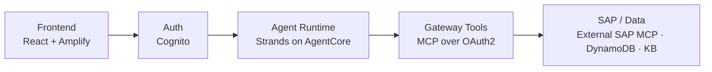
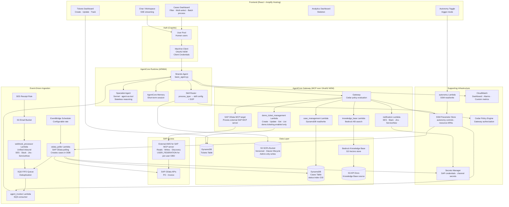

<!--
Copyright Amazon.com, Inc. or its affiliates. All Rights Reserved.
SPDX-License-Identifier: Apache-2.0
-->

# Architecture

## Overview

Five layers, left to right:

**What happens when an exception arrives:** the `odata_poller` Lambda polls SAP on a schedule (service-account auth) and writes cases to DynamoDB, or an inbound webhook/email lands via `webhook_processor`. New work is enqueued to an SQS FIFO queue; `agent_invoker` consumes it and invokes the AgentCore Runtime. The Strands agent loads the matching skill + SOP, reasons over the case, and calls Gateway tools (case updates, notifications, KB search, and SAP OData via the external AWS for SAP MCP server) — each gated by Cedar policy at the Gateway.

## Full architecture

The diagram below shows the complete system.

## Component Summary

### Frontend
React SPA hosted on Amplify. Five main views:
- **Workspace / Chat** — context-aware chat with SSE streaming; selected cases are injected as agent context
- **Cases Dashboard** — lists all cases from DynamoDB, supports filtering, multi-select, and batch processing
- **Case Detail** — per-case view with agent traces, status, and metadata
- **Analytics Dashboard** — skeleton for future operational metrics and trend analysis
- **Tickets Dashboard** — create, update, and track tickets for escalations and approval workflows

### Auth
- **Cognito User Pool** — human user authentication (OIDC code flow)
- **Machine Client** — OAuth2 client credentials flow for agent-to-gateway M2M auth

### Event-Driven Ingestion
- **odata_poller** — polls SAP OData APIs on a configurable EventBridge schedule, creates/updates cases in DynamoDB, enqueues to SQS when `trigger-mode: auto`
- **webhook_processor** — unified inbound handler for SES email (via S3), Slack, Jira, and ServiceNow webhooks; normalizes to standard payload and enqueues to SQS
- **agent_invoker** — SQS FIFO consumer that invokes the AgentCore Runtime per case

### AgentCore Runtime
- **Strands Agent** — main agent loop; uses Skill Router to load domain expertise + SOP at runtime
- **Skill Router** — maps `process_type` → skill config + SOP from S3; no code changes needed to add new domains
- **Specialist Agent** — optional Sonnet agent-as-tool for complex reasoning tasks (enabled per-skill via `multi_agent: true`)
- **AgentCore Memory** — short-term session memory across turns

### AgentCore Gateway
MCP-over-OAuth2 proxy that routes agent tool calls. Cedar policies are evaluated before each tool invocation. Homegrown tools are backed by Lambda; SAP OData is a Gateway MCP **target** that proxies the external AWS for SAP MCP server (read/write/discovery) — not a Lambda. SAP writes are gated by Cedar policy at the Gateway (role-based permits on create/update/function-import; delete forbidden) and by the external MCP server's write-enablement knobs.

| Tool | Backing | Purpose |
|------|---------|---------|
| `case_management` | Lambda | DynamoDB case read/write |
| `notification` | Lambda | Multi-channel outbound (SES/Slack/Jira/ServiceNow) |
| `knowledge_base` | Lambda | Bedrock KB semantic search over SAP API docs |
| `demo_ticket_management` | Lambda | Ticket create/update/get/list — only when `demo.ticketing.enabled` |
| SAP OData | MCP target | Read/write/discovery via external AWS for SAP MCP server (see [ADR-012](../design-decisions/012-sap-mcp-server-integration.md)) |

### SAP Access
All SAP OData (read, write, discovery) flows through the external [AWS for SAP MCP server](../design-decisions/012-sap-mcp-server-integration.md), reached as a Gateway MCP target. Interactive per-user SAP access uses that server's USER_FEDERATION (OBO) flow. The `odata_poller` Lambda is the only component that calls SAP directly, using service-account Basic Auth from Secrets Manager. See [SAP MCP Integration](../sap/SAP_MCP_INTEGRATION.md) and [Connectivity & Auth](../sap/CONNECTIVITY_AND_AUTH.md).

### Data Layer
- **DynamoDB Cases Table** — composite key (`document_number` + `item_id`), `status-index` GSI, TTL
- **DynamoDB Tickets Table** — ticket management for escalations and approval workflows
- **S3 SOPs Bucket** — versioned, Glacier lifecycle, admin-only writes; SOPs injected into agent prompt at runtime
- **S3 API Docs** — SAP API documentation synced to Bedrock Knowledge Base
- **Bedrock Knowledge Base** — S3 Vectors-backed vector store for semantic API doc search

### Supporting Infrastructure
- **SSM Parameter Store** — autonomy controls, resource ARNs, notification channel config
- **Secrets Manager** — SAP credentials, notification channel secrets (Slack token, Jira API key, etc.)
- **CloudWatch** — custom agent metrics (`AgentInvocations`, `AgentErrors`, `AgentLatencyMs`, `AgentTurns`), dashboard, alarms
- **Cedar Policy Engine** — evaluates authorization policies before each Gateway tool invocation
