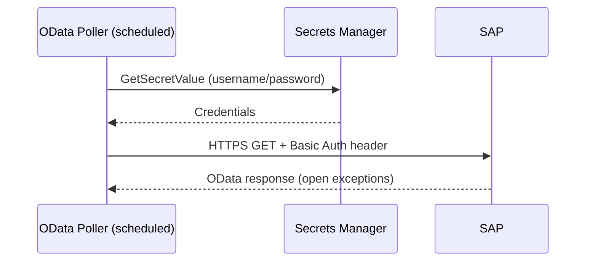

<!--
Copyright Amazon.com, Inc. or its affiliates. All Rights Reserved.
SPDX-License-Identifier: Apache-2.0
-->

# SAP Connectivity & Auth

> **New to SAP setup here?** Read this first, then [SAP_SETUP.md](./SAP_SETUP.md) to configure, then [SAP_MCP_INTEGRATION.md](./SAP_MCP_INTEGRATION.md) if you need the MCP server.

Both SAP connectivity and auth are configured in `config.yaml`. The agent, tool Lambdas, and frontend code are identical regardless of how SAP is reached.

> **SAP access model.** The agent reaches SAP exclusively through the external **AWS for SAP MCP server** (a Gateway MCP target) — reads, writes, and discovery. The only component that calls SAP *directly* is the autonomous **OData poller** (a scheduled Lambda that cannot use the Gateway/MCP tools), and it uses a **service-account** (basic auth). There is no per-user SAP identity mode in this sample; interactive user→SAP identity is handled by the MCP server's `USER_FEDERATION` flow (see [SAP MCP integration](./SAP_MCP_INTEGRATION.md) and [same-sub federation](./SAP_MCP_SAME_SUB_FEDERATION.md)).

## SAP Connectivity

Set `sap.base_url` in `config.yaml` to the SAP OData endpoint URL. That's it — no networking resources are created by CDK.

### How it works

`SapConnectivity` construct (`cdk/lib/constructs/sap-connectivity.ts`):
1. Stores `sap.base_url` in SSM parameter `/{stack}/connectivity/sap-base-url`
2. Creates the shared `sap_auth` Lambda layer (service-account credential fetch + error sanitization)
3. `attachToLambda()` attaches the layer + env vars on the OData poller

The poller reads the base URL from SSM and credentials from Secrets Manager, then makes plain HTTPS GETs. The networking layer is your responsibility.

### Deployment scenarios

| Scenario | `sap.base_url` | `backend.network_mode` | You manage |
|----------|---------------|----------------------|------------|
| SAP BTP / Cloud | Public URL (e.g. `https://my-api.s4hana.ondemand.com`) | `PUBLIC` (default) | Nothing extra |
| SAP RISE on AWS | Private DNS (e.g. `https://sap-rise.internal:443`) | `VPC` | VPC peering between your VPC and SAP RISE VPC |
| SAP on-prem | Private DNS (e.g. `https://sap-ecc.corp:8443`) | `VPC` | Site-to-Site VPN or Direct Connect |
| SAP on EC2 (same account) | Private IP (e.g. `https://10.0.1.50:8443`) | `VPC` | Security group rules |

For private SAP endpoints, set `backend.network_mode: VPC` and provide your VPC/subnet/SG IDs in `backend.vpc`. This does two things:

1. Places the **AgentCore Runtime** (Docker container) into your VPC
2. Places the **OData poller** into your VPC so it can reach private SAP endpoints

Non-SAP Lambdas (`notification`, `knowledge_base`, `case_management`, `ticket_management`) stay in public networking — they only call AWS APIs and don't need VPC access.

The VPC-placed components (AgentCore Runtime + OData poller) need a path to reach AWS APIs (SSM, Secrets Manager, SQS, CloudWatch, Bedrock). Provide **either** the full set of interface/gateway VPC endpoints **or** a NAT Gateway — see [VPC egress: endpoints or NAT](../getting-started/DEPLOYMENT.md#vpc-egress-endpoints-or-nat) for the trade-off and the complete endpoint list. The AgentCore Gateway invokes Lambdas over the AWS backbone, not the internet, so no additional Gateway networking is needed.

### Configuration

```yaml
sap:
  base_url: https://my-sap-host.example.com:443
```

### Credential flow

1. CDK creates a Secrets Manager secret: `{stack_name_base}/sap-credentials` with keys `base_url`, `username`, `password`
2. CDK stores the secret ARN in SSM: `/{stack_name_base}/secrets/sap-credentials-arn`
3. The poller reads the ARN from SSM, then fetches the secret
4. `./scripts/sync-sap-secret.sh` updates the secret values

These same credentials are what you configure on the external AWS for SAP MCP server (BASIC auth) for the agent's interactive SAP access.

## Frontend Auth Providers

`sap.auth_provider` selects the **frontend login** IdP (how a human signs in to the web app). It is independent of SAP identity.

| Provider | Mechanism | Notes |
|----------|-----------|-------|
| `cognito` | AWS Cognito User Pool | Default — already provisioned by the Cognito stack |
| `okta` | Okta OIDC | Requires `issuer_url` + `client_id` |
| `custom-oidc` | Any OIDC provider | Requires `issuer_url` + `client_id` |

### Configuration examples

```yaml
# cognito (default)
sap:
  auth_provider: cognito

# okta
sap:
  auth_provider: okta
  auth:
    issuer_url: https://dev-12345.okta.com/oauth2/default
    client_id: 0oa1234567890abcdef  # gitleaks:allow (example placeholder)

# custom OIDC
sap:
  auth_provider: custom-oidc
  auth:
    issuer_url: https://auth.example.com
    client_id: my-client-id
    scopes: openid profile email
```

## SAP Machine Identity (service-account)

The OData poller authenticates to SAP as a machine user (e.g. `SVC_AGENT`) via Basic Auth, reading the credentials from Secrets Manager. There is nothing to configure beyond running `sync-sap-secret.sh` to populate the secret.



## Interactive user → SAP

When a human drives the agent and the action must reach SAP **as that user**, identity is handled by the external AWS for SAP MCP server's `USER_FEDERATION` flow, not by anything in this stack. See:

- [SAP MCP integration](./SAP_MCP_INTEGRATION.md) — the Gateway MCP target + USER_FEDERATION
- [Same-sub federation](./SAP_MCP_SAME_SUB_FEDERATION.md) — letting SAP IAS consume the user-facing Cognito pool as a corporate IdP so the federated user is the real human

## Gateway-level write enforcement

SAP writes (`odata_create` / `odata_update` / `odata_function_import`) are authorized at the Gateway, independent of the agent's reasoning:

- **Cedar policies** (`agentcore/policies/sap_agent_policies.cedar`) gate writes on the caller's role (finance / procurement / admin) and forbid `odata_delete` outright. Cedar runs at the Gateway before the request reaches the MCP server, so the agent cannot reason around it.

## Gateway Header Propagation

AgentCore Gateway delivers request headers to tool Lambdas via the Lambda **context** object, not the event body:

```python
# In your tool Lambda handler:
headers = context.client_context.custom.get("bedrockAgentCorePropagatedHeaders", {})
```

The Gateway's `allowedRequestHeaders` configuration controls which headers are propagated:
- `x-audit-correlation-id` — distributed trace ID
- `x-audit-initiator` — who initiated the action
- `x-audit-trigger` — what triggered it (manual, poller, webhook)

### Header Namespaces

| Namespace | Direction | Purpose |
|-----------|-----------|---------|
| `x-audit-*` | Agent → Gateway → Tool Lambda | Internal audit baggage propagation |
| `x-sap-ext-*` | Tool Lambda → SAP | SAP-facing custom extension headers |
| `x-correlationid` | Tool Lambda → SAP | SAP-standard distributed trace header |
